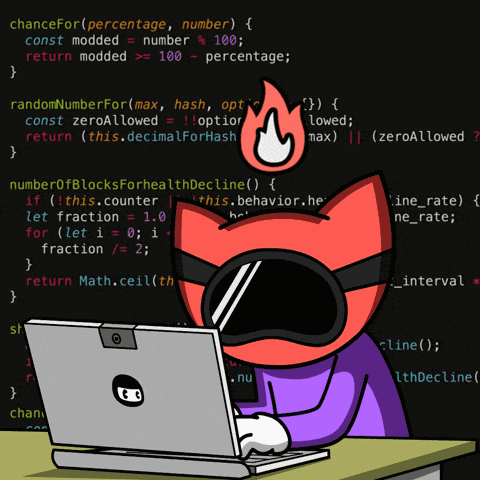

<h1>💫 Hi 👋, I'm Sanath Shukla</h1>
<h2>🚀 AI-Research | Data Analyst | Full Stack Developer | Tech Enthusiast</h2>

MCA (AI & Data Science) student focused on building AI-powered, data-driven systems using machine learning, data science, and full-stack development, with an interest in scalable, real-world solutions.

  
    
  

 

<h1> 💻 Tech Stack</h1>

### 🗣️ Programming Languages

  

### 🌐 Frontend Development

  
  
  

### 📱 Mobile App Development

  
  

### 🤖 AI / ML

  
  

### 🗄️ Databases

  
  
  

### ⚙️ Frameworks

  

### 🚀 DevOps & Tools

  

---

# 📊 GitHub Stats:

---

  

---

## 🔗 Connect with Me

  

  

  

---
